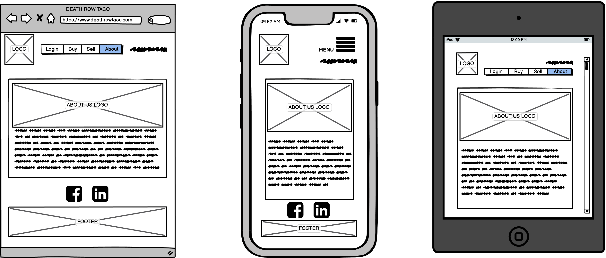

# Welcome to DEATH ROW TACO

This is an assignment for Coder Academy - T1A3 - by Mathew Lawton.

**Death Row Taco** is a unique, fictional two-way marketplace app for buying and selling in-house made Tacos by everyday legends from across Perth, W.A.

## R7 Identification of the problem you are trying to solve by building this particular marketplace app

"The  issue  of  food  insecurity  in  Australia  has  never  been  more  prominent  than  it is  right  now. The global  pandemic  has  put a  spotlight on  the  crisis  that  for  too long  has  flown  under society’s  radar" - [The FoodBank Hunger Report 2021](https://reports.foodbank.org.au/wp-content/uploads/documents/2021-Foodbank-Hunger-Report-PDF.pdf)

[The FoodBank Hunger Report 2021](https://reports.foodbank.org.au/wp-content/uploads/documents/2021-Foodbank-Hunger-Report-PDF.pdf) implies that many everyday legends across Australia are going hungry and we know for a fact that many locals in Perth, W.A share a passion for Taco's, and not just any Taco, but Tacos made by locals, for the locals. But access to affordable, currently registered food vans and shop front space such as restuarants are scarce, almost null. Residents across Perth who are considering starting their own food truck business or a restuarant can now have an opportunity to join an online community of like-minded individuals who are either buying or selling home made Tacos, to grow, market and scale their in-house small business, break boundaries and demistify the home made Taco reselling industry.

## R8 Why is it a problem that needs solving?

I believe this is a problem that not only needs to be addressed but needs a solution for many reasons, here are just a few that I came up with in order to plan, draft, create and fabricate an MVP for Death Row Taco.

- Filling a gap in the market. People want this, people need this but there is nothing currently that allows this.
- Feeding hungry people. According to the report mentioned above, this needs to happen, now!
- Helping small business to launch, grow and scale. Use our platform and like weeds we will grow together!
- Helping unemployed people with skills in cookery find new opportunities.
- Giving people jobs or allowing them to create a side hustle to prosper.
- Providing people with opportunities that allow them to grow and prosper.

### With the above taken into consideration, what are some of the avantages of the Death Row Taco platform?

- Requires low initial investment for individuals who are interested in a side hussle or who may be considering starting their own food van business.
- By using Death Row Taco's platform you can save hundreds and thousands on business set-up costs and put all that extra money towards marketing and growing your online business.

## R9 A link (URL) to your deployed app (i.e. website)

## R10 A link to your GitHub repository (repo)

- Link to my GitHub Repository - <https://github.com/Matlawton/coder-academy-t2a2>

## R11 Description of your marketplace app (website), including

### Purpose

The purpose of this marketplace app is to allow everyday legends from across Perth, Western Australia to have an opportunity to choose a new path for creating a food market style business. Previously aspiring small business owners in this space would have to fork out thousands of dollars for a store front or a food van and then fork out even more to advertise, market and scale their business and dream. The purpose at Death Row Taco is to allow any and all individuals a platform that allows them to grow and scale their in-house taco making business.

### Functionality / features

For my MVP marketplace app I was able to develop features and site functionality for Death Row Taco which are moulded around our user case stories such that we listened to our customers and we designed an application that allows a user to do the following;

- A user can browse the website as a guest.
- A user can sign up and gain access to the listings page where they can sell items.
- A user can access a dashboard to view their account settings and edit them.
- A user can view, edit and delete a listing if they were the creator of the listing.
- A user can delete their account and private information related to the account such as username.
- A user can search for available listings.
- A user can view a full detailed description, image and condition of each listing item for sale.
- A user can create a new listing to sell and provide an image thanks to AWS S3 bucket.
- Death Row Taco provides private and confidential user authentication to protect all users.

### Sitemap

Here is my Sitemap for Death Row Taco.

### Screenshots

### Target audience

The target audience for my marketplace app are,

- Small Business Owners.
- Aspiring business owners.
- Aspiring chefs.
- Food market chefs.
- Food critics.
- Taco enthusiasts.
- Home cooks.
- Stay at home parents.
- Busy workaholics who don't have time to meal prep.
- Any and all individuals above the age of 16 looking to buy a Taco and make an online purchase.
- Any and all individuals looking to create and sell Taco's(Registered users must be over the age of 16).
- Individuals looking for a side hustle or passive income.

### Tech stack

- [Ruby](https://www.ruby-lang.org/en/)
- [Ruby on Rails](https://rubyonrails.org/)
- [Postgresql](https://www.postgresql.org/)
- [HTML5](https://developer.mozilla.org/en-US/docs/Glossary/HTML5)
- [CSS3/SCSS](https://developer.mozilla.org/en-US/docs/Web/CSS)
- [JavaScript](https://www.javascript.com/)
- [Bootstrap](https://getbootstrap.com/)
- [Devise](https://github.com/heartcombo/devise)
- [Git](https://git-scm.com/)
- [GitHub](https://www.github.com/)
- [Heroku](https://www.heroku.com/)
- [AWS S3](https://aws.amazon.com/s3/)
- [VS Code](https://code.visualstudio.com/)
- [Canva](https://www.canva.com/) (Design work, presenation)
- [App.diagram](https://app.diagrams.net/) (ERD, Sitemap)
- [Balsamiq](https://balsamiq.com/)
- [Trello/Kanban](https://trello.com/)
- [Simple Form](https://github.com/heartcombo/simple_form)

### R12 User stories for your app

**As a potential user or guest:**

- I want to sign up and gain access to the application.
- I want to create a personal account and log in to the app.
- I want to see a dashboard that shows me I am logged in and provides user settings.
- I want to edit my account details.
- I want to have access to the authorised parts of the application and browse the list of available items.
- I want to make a profile and personalise it with my information.
- I want to edit my profile details.
- I want to remove and destroy my profile.

**As a potential buyer:**

- I want to search for available items.
- I want to add the item to the cart.
- I want to see a full detailed description of items for sale.
- I want to see a photo of the item for sale.
- I want to know the condition of the item for sale.
- I want to purchase an item.
- I want to select a custom delivery address.
- I want to see the list of my confirmed ordered products in the cart.
- I want to provide feedback for a purchase.

**As a seller:**

- I want to add my product details.
- I want to edit my product details.
- I want to remove my product if product has expired or been removed for other reasons.
- I want feedback on my items sold.

**Authentication & Privacy:**

- I want my personal information and data to be protected.
- I want my dashboard to be private and not displayed publicly.
- I want my purchases to be private and not shared.
- I do not want other users to have access to editing or manipulating my posts/listings.
- I do not want other users to see the items in my checkout cart.

## R13 Wireframes for your app

Here are my "Home/Index" page Desktop, Mobile(iphone) and Tablet wireframes.

Here is my "Login" page Desktop, Mobile(iphone) and Tablet wireframes.

Here is my "Buy" page Desktop, Mobile(iphone) and Tablet wireframes.

Here is my "Not a User" page Desktop, Mobile(iphone) and Tablet wireframes. This page will be displayed when a guest attempts to make a purchase prior to logging in to their account or before they have signed up.

Here is my "Sell" page Desktop, Mobile(iphone) and Tablet wireframes.

Here is my "About Us" page Desktop, Mobile(iphone) and Tablet wireframes.

## R14 An ERD for your app

Here is my Entity Relationship Diagram for Death Row Taco.

## R15 Explain the different high-level components (abstractions) in your app

The focalpoint and foundation for the Death Row Taco marketplace app is fabricated using the Ruby on Rails framework which utilises the Model-View-Controller architecture. Using and following this type of architecture when building my app allowed me to break up my apps functionality and logic into three unique layers. The Models, the views and the controller which links everything together. The view is the layer that an individual or end user directly interacts with via a brower or IoT device. The view layer has been created so that there isn't much logic being passed around by the model layer, this is handled almost exclusively by the controller layer. The controller layer is the man in the middle whom collates the info provded by the model and lets the view know how to display such info to the end user.

In the Death Row Taco marketplace app, our controller layers play a crucial role in facilitating our requests(routes) and manages the data or info passed onto the next layer such as a model or view. For example, if an end user would like to list a new taco for sale, sign-up and create a profile or something as simple as clicking a button, the app will send a request to the controller to execute this command from the end user and process the incoming route accordingly. An example if this would be if an end user would like to return to the home page from a sub page, the controller will handle this request by routing the input from the end user(click of a button) to the requested page, then it will process the data from the model and send the view back to the end user, which will be the home page.

Our model layers maintain the communications and relationship between our PostgreSQL database and operations for creating, reading, updating and deleting(CRUD Functionality) data that is stored in our database. For example if an end user has previously made a listing to sell a taco, our model would have engrained all the details about this listing into our database which can be recalled upong at any time to be viewed, updated, manipulated or destroyed. This is all done by our model layer. For the release of the Death Row Taco marketplace app, we currently have a products model that handles the CRUD functionality and authorisation on forms for our end users, we also have a users model which handles the CRUD functionality for user profiles and handles authorisation and authentication when signing up, logging in and creating an item to list. An example of how this is being used in our app is that if an already registered user decided to create a new item to list for sale, the model will execute a validation check on the given forms to make sure either no form is left blank or the minimum requirements supplied to the model are met, such as a minimum character count or a float to be supploed in the form field.

## R16 Detail any third party services that your app will use

- [Bootstrap](https://getbootstrap.com/)

I used *Bootstrap* to style my HTML and CSS components together for a beautiful looking web based application that is responsive and stylish. I used Bootstrap for my Navbar.

- [Devise](https://github.com/heartcombo/devise)

*Devise* is a Ruby gem for creating user authentication. I implemented Devise into my project to help facilitate and manage user authentication for new users looking to sign up and have their personal information stored on the database.

- [Git](https://git-scm.com/)

*Git* is a largely adopted and ever so popular source control tool that allows an individual to manage their projects timeline history and much more to control your project and the team building it. I implimented Git into my project as a way to save, track and facilitate my timeline and versions at each step of progress within my project.

- [GitHub](https://www.github.com/)

*GitHub* is one of the largest providers of Internet and web based hosting for software development teams and version control implimentations using Git. It provides source code management functionality for all members of the repository or project team. I utlized GitHub and continuously pushed my local repository to GitHub whenever I made siginificant achievements in the progress of my application.

- [Heroku](https://www.heroku.com/)

*Heroku* is a free to use cloud based platform that lets an individual build, deploy, monitor and scale their applications. I chose to use Heroku to deploy my application because I believe this is a very easy to use platform with a large support and knowledge base community behind it, making it easy for me to troubleshoot any issues that arose during my deployment.

- [AWS S3](https://aws.amazon.com/s3/)

*AWS* is a free to register cloud storage system/platform, but does come with some charges in cases where an end user has exceeded the free bandwidth limit allocated. S3 is one of the services by AWS and the term stands for "Simple Storage Service". This product offers instant scalability for individuals and business and also provides a high level of security. I chose to use and AWS S3 bucket for my project to allow an individual to be able to upload an image and have the image stored in my bucket for web viewing by another user who may be looking to purchase the item listed. As an individual starts to create their listing, they will be prompted to upload an image of their listing which is then sent to my AWS S3 bucket to be stored and called upon when needed.

- [VS Code](https://code.visualstudio.com/)

Owned by [Microsoft](https://www.microsoft.com/en-au/), *Visual Studo Code* is the most popular and flexible code editing software with a massive support network for troubleshooting or connecting a user to thousands of helpful extensions.

- [Canva](https://www.canva.com/)

*Canva* is an Australian founded online design and publishing tool, one of the first of it's kind to offer such tools and design templates to many people all around the world. I chose to use Canva for my logos, design work and to fabricate my slide deck presentation.

- [App.diagram](https://app.diagrams.net/)

*App.diagrams* is a free to use online design tool where users can create many types of tables, forms, maps, diagrams and much more either from scratch or by utilizing one of their hundreds of templates. I used App.diagram to fabricate my Sitemap and my Entity Relationship Diagram.

- [Balsamiq](https://balsamiq.com/)

*Balsamiq* is a for-profit design building software application that allows anybody with no prior experience in design work to successfully execute well thoughtout and professional wireframe mock ups for aspiring web develiopment and software development projects. I used Balsamiq with a keygen supplied by Coder Academy to facilitate the creation of my wireframe mock ups which allowed me to formulate a basic idea of the design layout for my marketplace app.

- [Trello/Kanban](https://trello.com/)

*Trello* is a very popular web-based, Kanban-style, list-making, web-based application service which is free to use for new members and is developed by a subsidiary of Atlassian known as Trello Enterprise. I used Trello and a kanban style board to facilitate the progression and management of my project, through careful consideration of tasks, goals, sprints and marks of achievement I was able to successfully manage, build and execute my project.

- [Simple Form](https://github.com/heartcombo/simple_form)

*Simple form* is like a mini library of pre constructed forms that an individual or team can utilise to quickly initate entire form creation scaffold and use within a project. I used Simple form to help me develop my forms such as login, sign up and list(sell) an item.

## R17 Describe your projects models in terms of the relationships (active record associations) they have with each other

Relating to the MVP submitted, below you can see my Product model, this model allows me to create the belongs_to relationship to my Users model by using `belongs_to :user` which means for each product listed, there must be one user. This model also has a relationship to the active record such that each product listed must have one picture attached to the listing by using the command `has_one_attached :picture`. To create and execute this has_one attached :picture function I used Amazon Web Services, S3 Bucket.

                class Product < ApplicationRecord
                    validates :name, presence: true, length: { minimum: 2 }
                    validates :description, presence: true, length: { maximum: 250 }
                    belongs_to :user
                    has_one_attached :picture
                end

Below is another example of how I implemented active storage relationships, this time you can see my User model which is created to handle the functionality and logic between a user and their relationships to Products which you can see by the command `has_many :products`. This means that each user can have many products and as mentioned above, each product must have one user.

                class User < ApplicationRecord
                    devise :database_authenticatable, :registerable, :recoverable, :rememberable, :validatable
                    has_many :products
                    validates :condition, presence: true, length: { minimum: 2 }
                end

## R18 Discuss the database relations to be implemented in your application

Above is a screenshot of my *Users* table from my database, you can see that the relationships I have with this table are being executed by the use a Primary Key where "user_id" is being used as a foreign key in other tables, such as products and purchases.

Above is a screenshot of my *Products* table from my database, you can see that the relationships I have with this table are being executed by the use a Primary Key where "product_id" is being used as a foreign key in other tables, such as purchases. Here you can also see the relationships from other corresponding tables by noticing the use of Foreign keys such as user_id and condition_id.

Above is a screenshot of my *Condition* table from my database, this database model was not created for the launch of my MVP and will be implimented at a later stage. You can see that the relationships I have with this table are being executed by the use a Primary Key where condition_id is being used as a foreign key in other tables, such as purchases.

Above is a screenshot of my *Purchases* table from my database, this database model was not created for the launch of my MVP and will be implimented at a later stage. You can see that the relationships I have with this table are being executed by the use a Primary Key where purchase_id is being used. You can also see here the relationships by corresponding tables by the use of foreign keys such as products_id and user_id.

## R19 Provide your database schema design

                ActiveRecord::Schema.define(version: 2021_11_19_044759) do
                enable_extension "plpgsql"

                create_table "active_storage_attachments", force: :cascade do |t|
                    t.string "name", null: false
                    t.string "record_type", null: false
                    t.bigint "record_id", null: false
                    t.bigint "blob_id", null: false
                    t.datetime "created_at", null: false
                    t.index ["blob_id"], name: "index_active_storage_attachments_on_blob_id"
                    t.index ["record_type", "record_id", "name", "blob_id"], name: "index_active_storage_attachments_uniqueness", unique: true
                end

                create_table "active_storage_blobs", force: :cascade do |t|
                    t.string "key", null: false
                    t.string "filename", null: false
                    t.string "content_type"
                    t.text "metadata"
                    t.string "service_name", null: false
                    t.bigint "byte_size", null: false
                    t.string "checksum", null: false
                    t.datetime "created_at", null: false
                    t.index ["key"], name: "index_active_storage_blobs_on_key", unique: true
                end

                create_table "active_storage_variant_records", force: :cascade do |t|
                    t.bigint "blob_id", null: false
                    t.string "variation_digest", null: false
                    t.index ["blob_id", "variation_digest"], name: "index_active_storage_variant_records_uniqueness", unique: true
                end

                create_table "products", force: :cascade do |t|
                    t.string "name"
                    t.text "description"
                    t.float "price"
                    t.bigint "user_id", null: false
                    t.datetime "created_at", precision: 6, null: false
                    t.datetime "updated_at", precision: 6, null: false
                    t.index ["user_id"], name: "index_products_on_user_id"
                end

                create_table "users", force: :cascade do |t|
                    t.string "email", default: "", null: false
                    t.string "encrypted_password", default: "", null: false
                    t.string "reset_password_token"
                    t.datetime "reset_password_sent_at"
                    t.datetime "remember_created_at"
                    t.datetime "created_at", precision: 6, null: false
                    t.datetime "updated_at", precision: 6, null: false
                    t.string "username"
                    t.index ["email"], name: "index_users_on_email", unique: true
                    t.index ["reset_password_token"], name: "index_users_on_reset_password_token", unique: true
                end

                add_foreign_key "active_storage_attachments", "active_storage_blobs", column: "blob_id"
                add_foreign_key "active_storage_variant_records", "active_storage_blobs", column: "blob_id"
                add_foreign_key "products", "users"
                end

## R20 Describe the way tasks are allocated and tracked in your project

[Please click here to view my public Trello Board.](https://trello.com/b/FBzr4GXw/deathrowtaco)

To allocate, track and execute tasks and manage the development of my project I chose to use Trello, with a kanban template. After creating my basic structure I installed some power-ups such as Card Priority which allowed me to track the urgency and set deadline due dates for each task and card. I chose to use Canva for my design work in the Trello board.

Below are some screen shots of how my Trello board was optimized at different stages throughout the development of my app.

